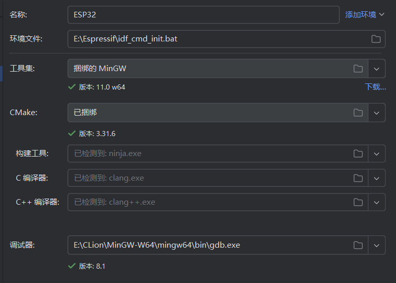
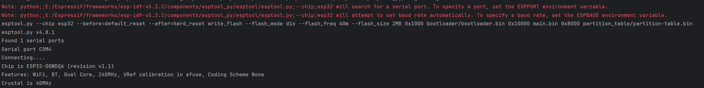
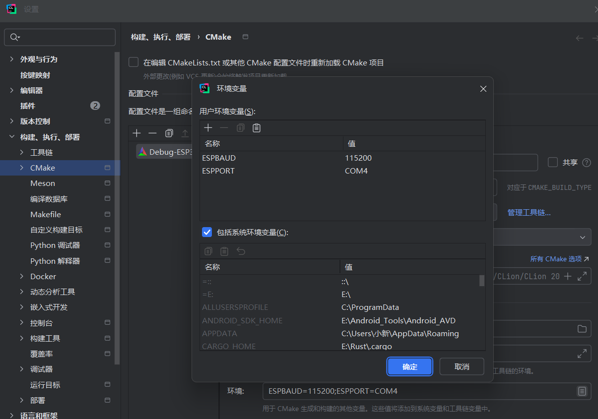
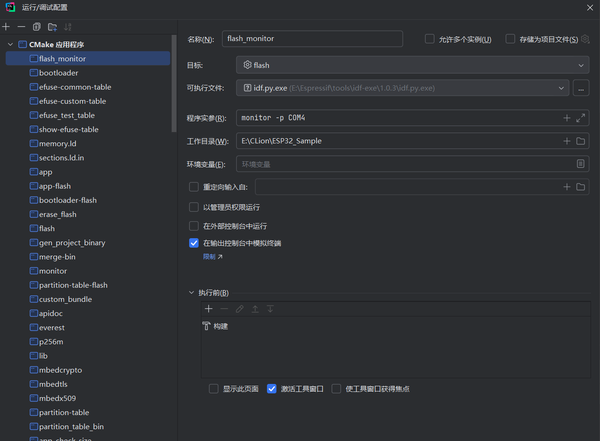
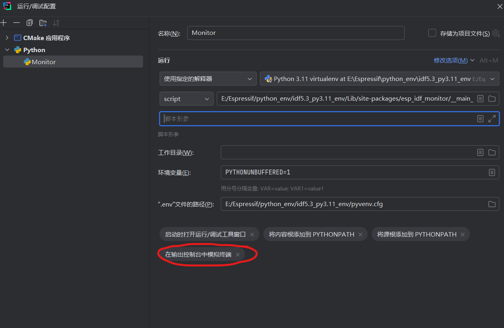

# 🚀 ESP32 Demo 工程说明

ESP32 示例工程，适用于 **ESP-WROOM-32** 开发板，演示在 **CLion** 下如何进行环境配置和程序调试。


## 📁 项目结构说明

本工程基于 **ESP32** 开发板，演示了如何在 **CLion** 中搭建 ESP-IDF 开发环境及进行调试


## 🛠️ 开发环境要求

- **开发板**：ESP-WROOM-32
- **开发工具链**：
  - CLion 2025.1
  - ESP-IDF v5.3.3
  - GCC 工具链


## ⚙️ 环境配置步骤

### 1️⃣ 安装 ESP-IDF

访问官方 [ESP-IDF 下载链接](https://dl.espressif.com/dl/esp-idf/)，建议科学上网。安装路径中**不要包含中文**或特殊字符。

#### 常见错误

若出现以下错误：

```
ERROR: Failed to check the tool while installed
```

一般是由于**用户名包含中文**所致。解决方法如下：

- 进入设置：**更改时区** → **语言和区域**
- 勾选：**Beta: 使用 Unicode UTF-8 提供全球语言支持**
- 重新安装 ESP-IDF 即可

### 2️⃣ 配置 CLion

修改自动生成的配置文件 `idf_cmd_init.bat`，添加以下内容（请根据实际路径修改）：

```
bat复制编辑:: set IDF_PATH
set IDF_PATH=E:\Espressif\frameworks\esp-idf-v5.3.3
```

工具链配置示例：

> 

配置完成后，点击 CLion 中的 **flash** 配置，再点击锤子图标 🔨 进行编译：

> 

编译过程中会提示设置 `ESPPORT` 和 `ESPBAUD`，可以手动设置，也可默认自动选择。

> 

# 📡 使用 CLion Monitor 串口监视器

若直接点击 monitor 出现如下错误：

```
Note: python;-m;esp_idf_monitor will search for a serial port. To specify a port, set the ESPPORT environment variable.
Error: Monitor requires standard input to be attached to TTY. Try using a different terminal.
CMake Error at run_serial_tool.cmake:66 (message):
  python;-m;esp_idf_monitor failed.
```

### ✅ 替代解决方案

#### 方案一：使用 CLion Terminal

> 


#### 方案二：添加 Python 解释器并运行脚本

1. 设置路径：**设置** → **构建、执行、部署** → **Python 解释器**
2. 添加一个 Python 脚本，内容如下：

> 

⚠️ 注意：在 **“修改选项”** 中勾选 **“在输出控制台中模拟终端”**，否则可能会导致乱码输出。


